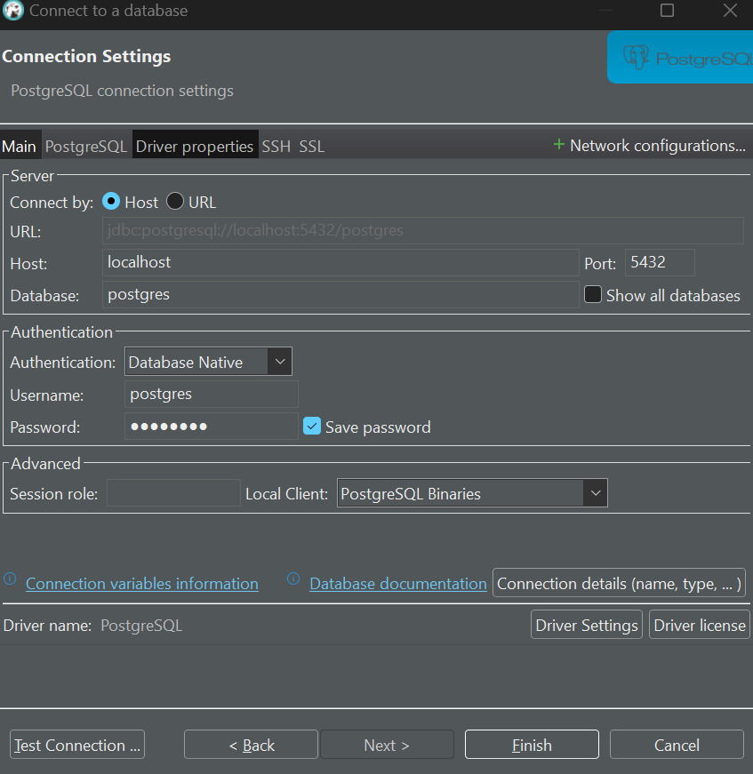

# BANK
### Requirements to deploy the project
### Install Postman
https://www.postman.com/
### Install Bruno
https://www.usebruno.com/
### Install DBeaver
https://dbeaver.io/
### Install Docker
https://www.docker.com/}
### Install Minikube
https://minikube.sigs.k8s.io/docs/start/?arch=%2Flinux%2Fx86-64%2Fstable%2Fdebian+package

# local compilation Docker Both Micro services
### Go to this folder in your command line
[Link to Docker file](./deploy/docker/)
### To build docker image in this directory insert following command
- `docker pull gradle:8.4-jdk21`
- `docker pull eclipse-temurin:21`
- `docker compose up -d`

# compilation to Docker Hub both Micro services
### Go to this folder in your command line
[Link to Docker file](./deploy/docker/)
### To build docker image in this directory insert following command
- `docker pull gradle:8.4-jdk21`
- `docker pull eclipse-temurin:21`
- `docker compose up -d`

### In DBeaver insert the tables from following folder
#### DBeaver CONFIG
##### Host: localhost
##### Database: postgres
##### username: postgres
##### password: postgres

### In DBeaver insert the tables from following folder
#### Client SQL
[Link to Client SQL](./client/config/sql/initialize.sql)
#### Account and Movement SQL
[Link to Account and Movement SQL](./account_movement/config/sql/initialize.sql)
### Load Postman collection
[Link to Postman Collection](./config/postman/)

## import in Postman or Bruno Folder /config/postman/
[Postman folder directory](./config/postman/)

# Documentations of the microservices
## Link to Client README.md
[Link to Client README](./client/README.md)

## Link to Accounts and Movement README.md
[Link to Accounts and Movement README](./account_movement/README.md)

# Minikube Kubernetes deployment instructions
[Link to Kubernetes Instructions](./deploy/k8s/README.md)