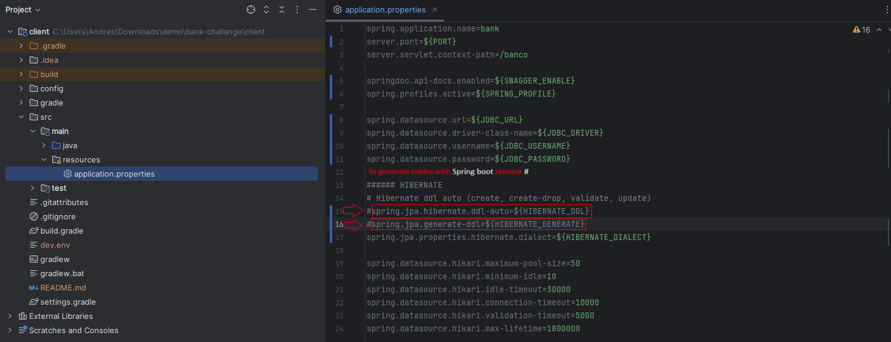
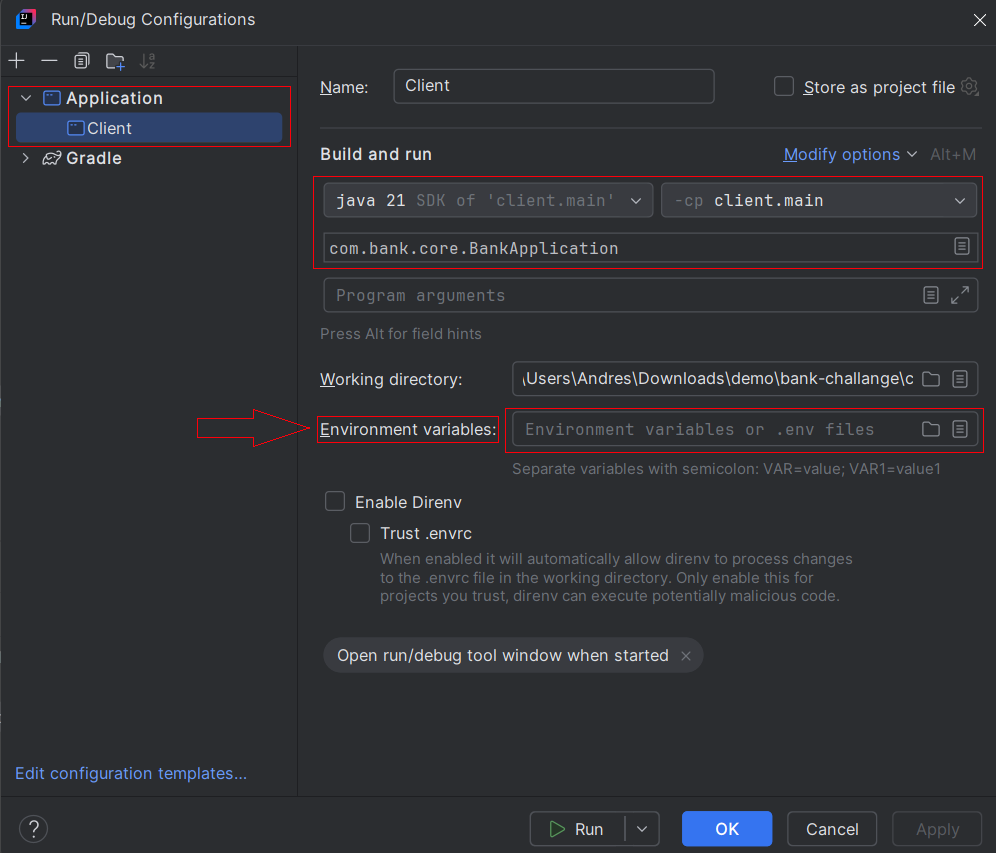
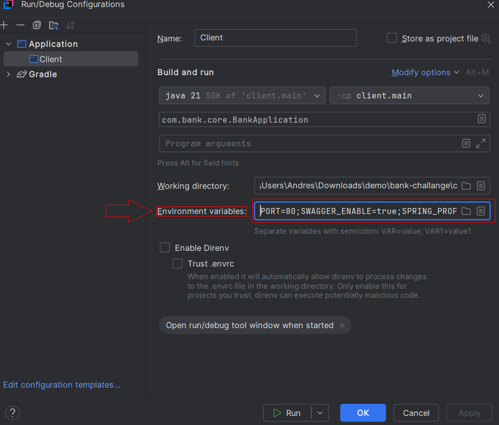

## Requirements to deploy the project
## Install Postgres 16

## Install Open Java 21 Corretto
## Install Intellij
https://www.jetbrains.com/idea/download/

## SDK man installation
https://sdkman.io/

## Install sdk man
- `curl -s "https://get.sdkman.io" | bash`

## Gradle installation
https://gradle.org/install/

## Install gradle 8.8
- `sdk install Gradle 8.8`

## Structure database from /config/sql/
[SQL folder directory](./config/sql/)__

[Create project tables](./config/sql/initialize.sql)__

[Delete project tables](./config/sql/roll_back.sql)__

### Generate Database with Spring Boot
To generate database with Spring Boot variables have to be true
- `HIBERNATE_DDL=create;`
- `HIBERNATE_GENERATE=true;`
  

## Postman Folder /config/postman/
[Postman folder directory](./config/postman/)

## Swagger Api Call only for localhost permitted for security reasons
http://localhost/banco/swagger-ui/index.html#/

## Environment variables for Local machine

### Variables for intellij
- `PORT=83;SWAGGER_ENABLE=true;SPRING_PROFILE=dev;JDBC_URL=jdbc:postgresql://localhost:5432/postgres;JDBC_DRIVER=org.postgresql.Driver;JDBC_USERNAME=postgres;JDBC_PASSWORD=postgres;HIBERNATE_DDL=create;HIBERNATE_GENERATE=true;HIBERNATE_DIALECT=org.hibernate.dialect.PostgreSQLDialect;CLIENT_ENDPOINT=http://localhost:80/api/clientes/?identificacion=;`
### Where to locate the variables in Intellij

### Environment variables for Docker or deploying in production
- `PORT=83;SWAGGER_ENABLE=true;SPRING_PROFILE=dev;JDBC_URL=jdbc:postgresql://localhost:5432/postgres;JDBC_DRIVER=org.postgresql.Driver;JDBC_USERNAME=postgres;JDBC_PASSWORD=postgres;HIBERNATE_DDL=create;HIBERNATE_GENERATE=true;HIBERNATE_DIALECT=org.hibernate.dialect.PostgreSQLDialect;CLIENT_ENDPOINT=http://localhost:80/api/clientes/?identificacion=;`

### Run tests
- `gradle test`

### To clean app
- `gradle clean`

### Before compiling
- `gradle task --all`

### To build app
- `gradle build`

### Run tests
- `gradle test`

#### Run in local machine
- `gradle bootRun`

#### Check network ip in windows
- `netsh interface ipv4 show neighbors`

#### Check network ip in debian
- `ip addr  `
- `ifconfig `

