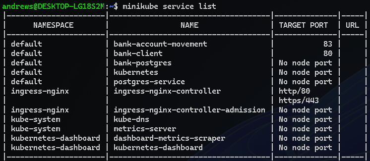
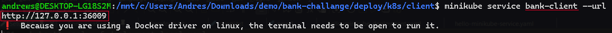
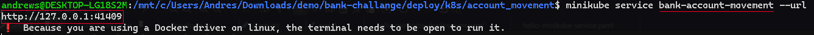
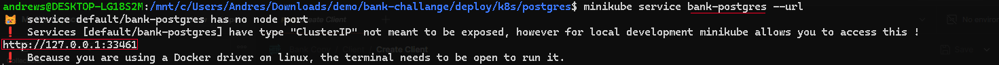
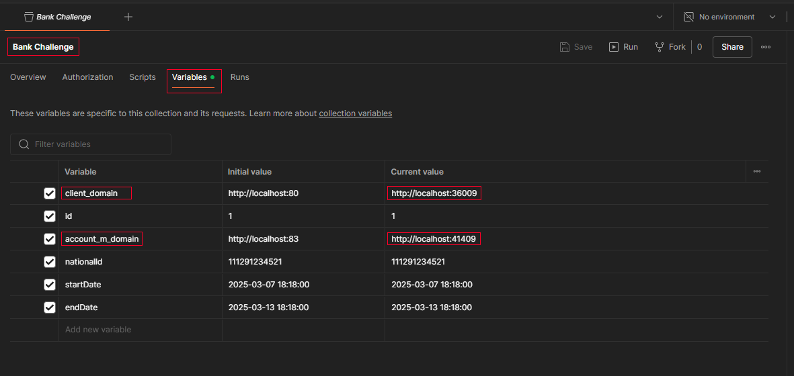

# Kubernetes Commands

## Link to Client Kubernetes files
[Link to Client Kubernetes files](./deploy/k8s/client/)
## Client Kubernetes commands
- `kubectl apply -f client-deployment.yaml`
- `kubectl apply -f client-service.yaml`

## Link to Account and Movement Kubernetes files
[Link to Account and Movement Kubernetes files](./deploy/k8s/account_movement/)
## Client Kubernetes commands
- `kubectl apply -f account-movement-deployment.yaml`
- `kubectl apply -f account-movement-service.yaml`

## Access Postgres Docker form kubernetes
[Link to Postgres Kubernetes files](./deploy/k8s/postgres/)
## Postgres Kubernetes commands
- `kubectl apply -f postgres-deployment.yaml`
- `kubectl apply -f postgres-service.yaml`

## Minikube Access pod from Postman
- `minikube service list`

- `minikube service bank-client --url`

- `minikube service bank-account-movement --url`

- `minikube service bank-postgres --url`

## Postman configurations to access endpoints in kubernetes pods
### Just change the port 
